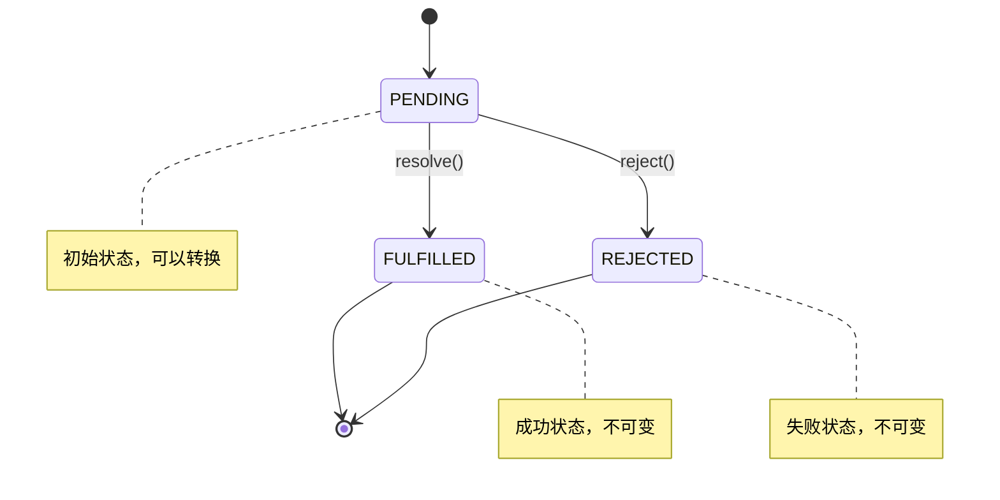

# Promise 手写实现详解

> 一个完整的 Promise/A+ 规范实现，从零开始构建异步编程的核心机制

## 📚 目录

- [项目概述](#项目概述)
- [核心特性](#核心特性)
- [文件结构](#文件结构)
- [实现原理](#实现原理)
- [代码详解](#代码详解)
- [使用示例](#使用示例)
- [问题分析](#问题分析)
- [改进建议](#改进建议)
- [学习要点](#学习要点)

---

## 🎯 项目概述

这是一个手写的 Promise 实现项目，遵循 Promise/A+ 规范，展示了 Promise 的核心工作原理。通过这个实现，你可以深入理解：

- Promise 的状态管理机制
- 异步操作的处理方式
- 链式调用的实现原理
- 错误处理和传播机制

## ✨ 核心特性

- ✅ **状态管理**: 实现 pending、fulfilled、rejected 三种状态
- ✅ **异步处理**: 使用订阅发布模式处理异步操作
- ✅ **链式调用**: 支持 `.then()` 方法的链式调用
- ✅ **错误处理**: 实现 `.catch()` 方法和错误传播
- ✅ **Promise 解析**: 处理返回值为 Promise 的情况
- ✅ **循环引用检测**: 防止 Promise 自引用导致的死循环

## 📁 文件结构

```
promise/
├── README.md              # 项目文档（本文件）
├── simplePromise.js       # 核心 Promise 实现
├── index.js              # 基础功能测试
├── index1.js             # catch 方法测试
├── demo.js               # 链式调用和文件读取演示
├── 1.text                # 测试数据文件
├── name.text             # 测试数据文件（包含 "1.text"）
└── .git/                 # Git 版本控制
```

---

## 🔧 实现原理

### 状态机制

Promise 基于状态机模式，具有三种互斥状态：



### 异步处理机制

使用**订阅发布模式**处理异步操作：

```javascript
// 订阅阶段：收集回调函数
this.onResolveCallBacks.push(callback);

// 发布阶段：执行所有回调
this.onResolveCallBacks.forEach((fn) => fn());
```

---

## 📖 代码详解

### 1. 状态常量定义

```javascript
const PEDDING = "pedding"; // 待定状态
const REJECTED = "rejected"; // 拒绝状态
const FULFILLED = "fufilled"; // 完成状态
```

### 2. Promise 构造函数

```javascript
class Promise {
  constructor(executor) {
    // 初始化状态和值
    this.value = undefined; // 成功的值
    this.reson = undefined; // 失败的原因
    this.status = PEDDING; // 当前状态

    // 异步回调队列
    this.onResolveCallBacks = []; // 成功回调队列
    this.onRejectCallBacks = []; // 失败回调队列

    // resolve 函数实现
    let resolve = (val) => {
      if (this.status == PEDDING) {
        this.value = val;
        this.status = REJECTED; // ⚠️ 这里有错误，应该是 FULFILLED
        this.onResolveCallBacks.forEach((fn) => fn());
      }
    };

    // reject 函数实现
    let reject = (res) => {
      if (this.status == PEDDING) {
        this.reson = res;
        this.status = FULFILLED; // ⚠️ 这里有错误，应该是 REJECTED
        this.onRejectCallBacks.forEach((fn) => fn());
      }
    };

    // 执行器错误捕获
    try {
      executor(resolve, reject);
    } catch (err) {
      reject(err);
    }
  }
}
```

### 3. then 方法实现

```javascript
then(onRejected, onFulfilled) {
    // 返回新的 Promise 实现链式调用
    let promise2 = new Promise((resolve, reject) => {

        // 处理已完成状态
        if (this.status == REJECTED) {  // ⚠️ 状态判断错误
            setTimeout(() => {
                try {
                    let x = onRejected(this.value)
                    resolvePromise(promise2, x, resolve, reject)
                } catch (e) {
                    reject(e)
                }
            })
        }

        // 处理已拒绝状态
        if (this.status == FULFILLED) {  // ⚠️ 状态判断错误
            try {
                let x = onFulfilled(this.reson)
                resolve(x)
            } catch (e) {
                reject(e)
            }
        }

        // 处理待定状态（异步情况）
        if (this.status == PEDDING) {
            this.onResolveCallBacks.push(() => {
                try {
                    let x = onRejected(this.value)  // ⚠️ 回调函数错误
                    resolve(x)
                } catch (e) {
                    reject(e)
                }
            });

            this.onRejectCallBacks.push(() => {
                try {
                    let x = onFulfilled(this.reson)  // ⚠️ 回调函数错误
                    resolve(x)
                } catch (e) {
                    reject(e)
                }
            })
        }
    });

    return promise2
}
```

### 4. resolvePromise 函数

这是处理 Promise 解析的核心函数：

```javascript
const resolvePromise = (promise2, x, resolve, reject) => {
  // 防止循环引用
  if (promise2 === x) {
    return reject(new TypeError(`引用的Promise为同一个promise`));
  }

  // 处理对象或函数类型的返回值
  if ((typeof x === "object" && x !== null) || typeof x === "function") {
    let called;
    try {
      let then = x.then(); // ⚠️ 错误：应该是 x.then

      then.call(
        x,
        (y) => {
          if (called) return;
          called = true;
          // 递归解析 Promise
          resolvePromise(promise2, y, resolve, reject);
        },
        (r) => {
          if (called) return;
          called = true;
          reject(r);
        }
      );
    } catch (e) {
      if (called) return;
      called = true;
      reject(e);
    }
  } else {
    // 普通值直接 resolve
    resolve(x);
  }
};
```

### 5. catch 方法实现

```javascript
catch(catchCallBack) {
    // catch 实际上是没有成功回调的 then
    return this.then(null, catchCallBack)
}
```

---

## 🚀 使用示例

### 基础用法

```javascript
const Promise = require("./simplePromise");

// 创建 Promise
let p = new Promise((resolve, reject) => {
  setTimeout(() => {
    resolve("成功了");
  }, 1000);
});

// 使用 then
p.then(
  (data) => {
    console.log("成功:", data);
  },
  (err) => {
    console.log("失败:", err);
  }
);
```

### 链式调用

```javascript
const fs = require("fs");

function readFile(name) {
  return new Promise((resolve, reject) => {
    fs.readFile(name, "utf-8", (err, data) => {
      if (err) reject(err);
      resolve(data);
    });
  });
}

// 链式读取文件
readFile("name.text")
  .then((data) => {
    console.log("第一个文件内容:", data);
    return readFile(data.trim()); // 读取第二个文件
  })
  .then((data) => {
    console.log("第二个文件内容:", data);
  })
  .catch((err) => {
    console.log("错误:", err);
  });
```

### 错误处理

```javascript
let p = new Promise((resolve, reject) => {
  setTimeout(() => {
    reject("出错了");
  }, 1000);
});

p.catch((err) => {
  console.log("捕获错误:", err);
});
```

---

## 🐛 问题分析

### 1. 状态管理错误

**问题**：resolve 和 reject 函数中的状态设置颠倒了

```javascript
// 错误的实现
let resolve = (val) => {
  if (this.status == PEDDING) {
    this.value = val;
    this.status = REJECTED; // ❌ 应该是 FULFILLED
  }
};

let reject = (res) => {
  if (this.status == PEDDING) {
    this.reson = res;
    this.status = FULFILLED; // ❌ 应该是 REJECTED
  }
};
```

**正确实现**：

```javascript
let resolve = (val) => {
  if (this.status == PEDDING) {
    this.value = val;
    this.status = FULFILLED; // ✅ 正确
    this.onResolveCallBacks.forEach((fn) => fn());
  }
};

let reject = (res) => {
  if (this.status == PEDDING) {
    this.reson = res;
    this.status = REJECTED; // ✅ 正确
    this.onRejectCallBacks.forEach((fn) => fn());
  }
};
```

### 2. then 方法逻辑错误

**问题**：状态判断和回调函数调用混乱

```javascript
// 错误的状态判断
if (this.status == REJECTED) {
  // ❌ 应该判断 FULFILLED
  let x = onRejected(this.value); // ❌ 应该调用 onFulfilled
}

if (this.status == FULFILLED) {
  // ❌ 应该判断 REJECTED
  let x = onFulfilled(this.reson); // ❌ 应该调用 onRejected
}
```

### 3. resolvePromise 函数错误

**问题**：获取 then 方法的方式错误

```javascript
let then = x.then(); // ❌ 错误：调用了 then 方法
```

**正确实现**：

```javascript
let then = x.then; // ✅ 正确：获取 then 属性
```

### 4. 缺少参数校验

**问题**：没有处理 onFulfilled 和 onRejected 为 undefined 的情况

**改进**：

```javascript
// 参数标准化
onFulfilled =
  typeof onFulfilled === "function" ? onFulfilled : (value) => value;
onRejected =
  typeof onRejected === "function"
    ? onRejected
    : (reason) => {
        throw reason;
      };
```

---

## 💡 改进建议

### 1. 修复核心错误

```javascript
// 修复状态设置
const PENDING = "pending";
const FULFILLED = "fulfilled";
const REJECTED = "rejected";

// 修复 resolve/reject 函数
let resolve = (val) => {
  if (this.status === PENDING) {
    this.value = val;
    this.status = FULFILLED; // ✅ 修复
    this.onResolveCallBacks.forEach((fn) => fn());
  }
};
```

### 2. 完善 then 方法

```javascript
then(onFulfilled, onRejected) {
    // 参数标准化
    onFulfilled = typeof onFulfilled === 'function' ? onFulfilled : value => value
    onRejected = typeof onRejected === 'function' ? onRejected : reason => { throw reason }

    let promise2 = new Promise((resolve, reject) => {
        if (this.status === FULFILLED) {
            setTimeout(() => {  // 使用微任务
                try {
                    let x = onFulfilled(this.value)
                    resolvePromise(promise2, x, resolve, reject)
                } catch (e) {
                    reject(e)
                }
            })
        }
        // ... 其他状态处理
    })

    return promise2
}
```

### 3. 添加静态方法

```javascript
// Promise.resolve
static resolve(value) {
    return new Promise((resolve) => {
        resolve(value)
    })
}

// Promise.reject
static reject(reason) {
    return new Promise((resolve, reject) => {
        reject(reason)
    })
}

// Promise.all
static all(promises) {
    return new Promise((resolve, reject) => {
        let results = []
        let count = 0

        promises.forEach((promise, index) => {
            Promise.resolve(promise).then(value => {
                results[index] = value
                count++
                if (count === promises.length) {
                    resolve(results)
                }
            }, reject)
        })
    })
}
```

### 4. 使用微任务

```javascript
// 使用 queueMicrotask 替代 setTimeout
if (typeof queueMicrotask !== "undefined") {
  queueMicrotask(() => {
    // 执行回调
  });
} else {
  setTimeout(() => {
    // 执行回调
  }, 0);
}
```

---

## 📝 学习要点

### 1. Promise 核心概念

- **状态不可逆**：一旦从 pending 转换到 fulfilled 或 rejected，就不能再改变
- **异步处理**：使用订阅发布模式处理异步操作
- **链式调用**：每个 then 方法都返回新的 Promise 实例
- **值穿透**：如果 then 的参数不是函数，会发生值穿透

### 2. 实现难点

- **循环引用检测**：防止 Promise 返回自身导致死循环
- **Promise 解析**：正确处理返回值为 Promise 的情况
- **错误传播**：确保错误能够正确传播到 catch 方法
- **微任务队列**：保证 Promise 回调在正确的时机执行

### 3. 调试技巧

```javascript
// 添加调试信息
console.log("当前状态:", this.status);
console.log("成功值:", this.value);
console.log("失败原因:", this.reason);
```

### 4. 测试用例

```javascript
// 测试基本功能
function test1() {
  let p = new Promise((resolve) => {
    resolve("success");
  });

  p.then((value) => {
    console.log("✅ 基本功能测试通过:", value);
  });
}

// 测试链式调用
function test2() {
  Promise.resolve(1)
    .then((x) => x + 1)
    .then((x) => x + 1)
    .then((x) => {
      console.log("✅ 链式调用测试通过:", x); // 应该输出 3
    });
}

// 测试错误处理
function test3() {
  Promise.reject("error").catch((err) => {
    console.log("✅ 错误处理测试通过:", err);
  });
}
```

---

## 🎓 总结

这个 Promise 实现虽然存在一些错误，但整体展示了 Promise 的核心工作原理：

**优点**：

- ✅ 基本的状态管理机制
- ✅ 异步操作处理（订阅发布模式）
- ✅ then 方法链式调用
- ✅ catch 方法实现
- ✅ Promise 解析逻辑
- ✅ 循环引用检测

**需要改进**：

- ❌ 状态设置错误
- ❌ then 方法逻辑混乱
- ❌ 缺少参数校验
- ❌ 微任务队列实现
- ❌ 静态方法缺失

通过学习和改进这个实现，可以深入理解 Promise 的工作机制，为掌握现代 JavaScript 异步编程打下坚实基础。

---

## 📚 参考资料

- [Promise/A+ 规范](https://promisesaplus.com/)
- [MDN Promise 文档](https://developer.mozilla.org/zh-CN/docs/Web/JavaScript/Reference/Global_Objects/Promise)
- [JavaScript 异步编程指南](https://javascript.info/async)
