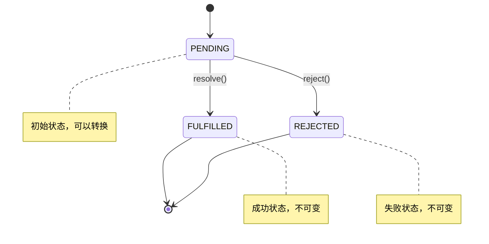
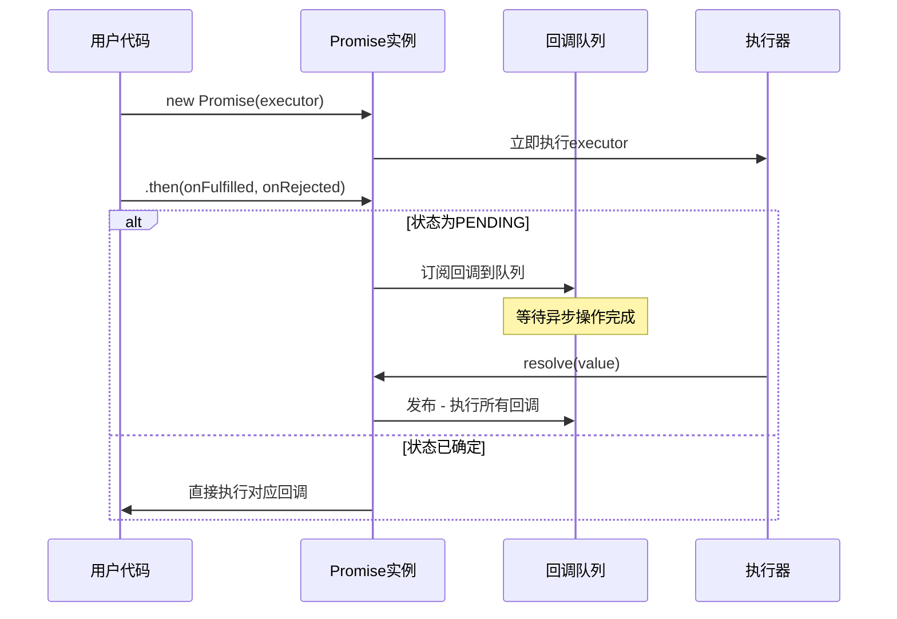
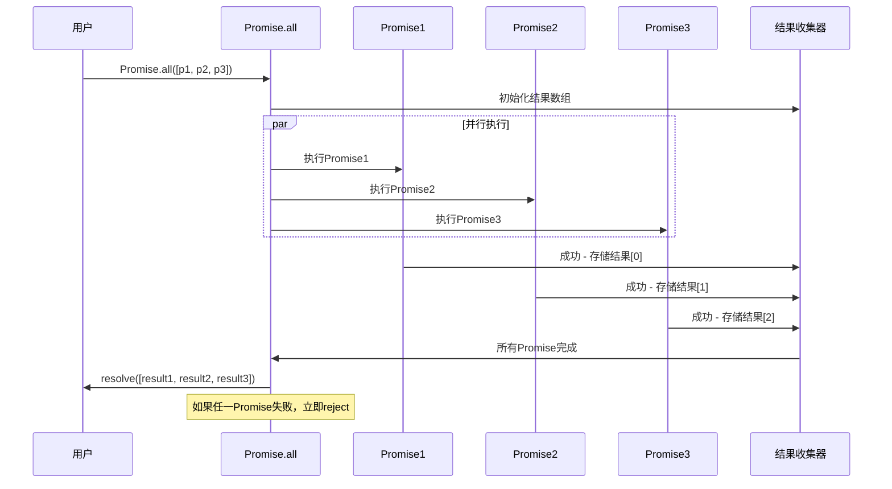
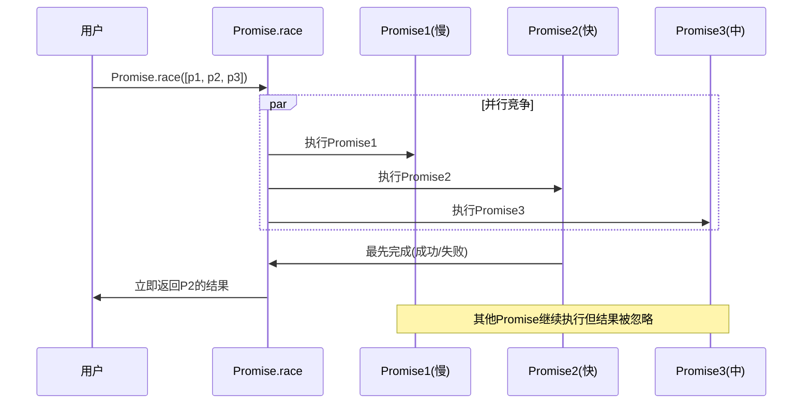

# Promise 手写实现详解

> 一个完整的 Promise/A+ 规范实现，从零开始构建异步编程的核心机制

## 📚 目录

- [项目概述](#项目概述)
- [核心特性](#核心特性)
- [文件结构](#文件结构)
- [实现原理](#实现原理)
- [静态方法深度解析](#静态方法深度解析)
- [核心代码实现详解](#核心代码实现详解)
- [使用示例](#使用示例)
- [实现特性总结](#实现特性总结)
- [性能优化与最佳实践](#性能优化与最佳实践)
- [学习要点](#学习要点)

---

## 🎯 项目概述

这是一个手写的 Promise 实现项目，遵循 Promise/A+ 规范，展示了 Promise 的核心工作原理。通过这个实现，你可以深入理解：

- Promise 的状态管理机制
- 异步操作的处理方式
- 链式调用的实现原理
- 错误处理和传播机制

## ✨ 核心特性

-  **状态管理**: 实现 pending、fulfilled、rejected 三种状态
-  **异步处理**: 使用订阅发布模式处理异步操作
-  **链式调用**: 支持 `.then()` 方法的链式调用
-  **错误处理**: 实现 `.catch()` 方法和错误传播
-  **Promise 解析**: 处理返回值为 Promise 的情况
-  **循环引用检测**: 防止 Promise 自引用导致的死循环

## 📁 文件结构

```
promise/
├── README.md              # 项目文档（本文件）
├── simplePromise.js       # 核心 Promise 实现
├── index.js              # 基础功能测试
├── index1.js             # catch 方法测试
├── demo.js               # 链式调用和文件读取演示
├── 1.text                # 测试数据文件
├── name.text             # 测试数据文件（包含 "1.text"）
└── .git/                 # Git 版本控制
```

---

## 🔧 实现原理

### 1. Promise 状态机制

Promise 基于状态机模式，具有三种互斥状态：



**状态转换规则：**

- **PENDING（待定）**: 初始状态，可以转换为 FULFILLED 或 REJECTED
- **FULFILLED（已完成）**: 操作成功完成，状态不可变，有一个成功值
- **REJECTED（已拒绝）**: 操作失败，状态不可变，有一个失败原因

### 2. 异步处理机制 - 订阅发布模式

Promise 使用**订阅发布模式**处理异步操作：

```javascript
// 订阅阶段：收集回调函数
this.onFulfilledCallbacks.push(callback);

// 发布阶段：执行所有回调
this.onFulfilledCallbacks.forEach((fn) => fn());
```

**工作流程：**



### 3. 微任务队列机制

Promise 回调需要在微任务队列中执行，确保正确的执行时机：

```javascript
const nextTick = (callback) => {
  if (typeof queueMicrotask !== "undefined") {
    queueMicrotask(callback); // 标准微任务API
  } else if (typeof process !== "undefined" && process.nextTick) {
    process.nextTick(callback); // Node.js环境
  } else {
    setTimeout(callback, 0); // 降级到宏任务
  }
};
```

### 4. Promise 解析算法

`resolvePromise` 函数是 Promise/A+ 规范的核心，处理 then 方法的返回值：

```mermaid
flowchart TD
    A[then方法返回值 x] --> B{x === promise2?}
    B -->|是| C[抛出TypeError - 循环引用]
    B -->|否| D{x是Promise实例?}
    D -->|是| E[x.then(resolve, reject)]
    D -->|否| F{x是对象或函数?}
    F -->|否| G[resolve(x) - 普通值]
    F -->|是| H{x.then是函数?}
    H -->|否| G
    H -->|是| I[调用x.then方法]
    I --> J{调用成功?}
    J -->|是| K[递归解析返回值]
    J -->|否| L[reject错误]

    style C fill:#ff6b6b
    style G fill:#4ecdc4
    style K fill:#45b7d1
```

### 5. 静态方法实现原理

#### Promise.all 实现原理

`Promise.all` 等待所有 Promise 完成，任一失败则整体失败：



**核心实现逻辑：**

```javascript
static all(promises) {
    return new Promise((resolve, reject) => {
        const results = []
        let completedCount = 0

        // 遍历所有Promise
        promises.forEach((promise, index) => {
            Promise.resolve(promise).then(
                value => {
                    results[index] = value  // 保持顺序
                    completedCount++

                    // 所有完成时resolve
                    if (completedCount === promises.length) {
                        resolve(results)
                    }
                },
                reason => reject(reason)  // 任一失败立即reject
            )
        })
    })
}
```

#### Promise.race 实现原理

`Promise.race` 返回最先完成的 Promise 结果：



**核心实现逻辑：**

```javascript
static race(promises) {
    return new Promise((resolve, reject) => {
        // 遍历所有Promise
        promises.forEach(promise => {
            // 最先完成的Promise决定结果
            Promise.resolve(promise).then(resolve, reject)
        })
    })
}
```

### 6. 其他静态方法原理

#### Promise.allSettled

等待所有 Promise 完成，不管成功还是失败：

```javascript
static allSettled(promises) {
    return new Promise(resolve => {
        const results = []
        let completedCount = 0

        promises.forEach((promise, index) => {
            Promise.resolve(promise).then(
                value => {
                    results[index] = { status: 'fulfilled', value }
                    if (++completedCount === promises.length) resolve(results)
                },
                reason => {
                    results[index] = { status: 'rejected', reason }
                    if (++completedCount === promises.length) resolve(results)
                }
            )
        })
    })
}
```

#### Promise.any

返回第一个成功的 Promise，所有失败才失败：

```javascript
static any(promises) {
    return new Promise((resolve, reject) => {
        const errors = []
        let rejectedCount = 0

        promises.forEach((promise, index) => {
            Promise.resolve(promise).then(
                value => resolve(value),  // 第一个成功立即resolve
                reason => {
                    errors[index] = reason
                    if (++rejectedCount === promises.length) {
                        reject(new AggregateError(errors, 'All promises were rejected'))
                    }
                }
            )
        })
    })
}
```

---

## 🔍 静态方法深度解析

### Promise.all 详细实现

**功能**: 并行执行多个 Promise，全部成功才成功，任一失败则失败

**应用场景**:

- 需要等待多个异步操作全部完成
- 多个 API 请求并行执行
- 批量文件读取操作

```javascript
static all(promises) {
    return new Promise((resolve, reject) => {
        // 参数验证
        if (!Array.isArray(promises)) {
            return reject(new TypeError('Promise.all accepts an array'))
        }

        // 空数组直接返回
        if (promises.length === 0) {
            return resolve([])
        }

        const results = []
        let completedCount = 0

        promises.forEach((promise, index) => {
            // 确保每个元素都是Promise
            Promise.resolve(promise).then(
                value => {
                    results[index] = value  // 保持原始顺序
                    completedCount++

                    // 所有Promise完成时resolve
                    if (completedCount === promises.length) {
                        resolve(results)
                    }
                },
                reason => {
                    reject(reason)  // 任一失败立即reject
                }
            )
        })
    })
}
```

**使用示例**:

```javascript
// 并行请求多个API
const fetchUserData = () => Promise.resolve({ name: "John", age: 30 });
const fetchUserPosts = () => Promise.resolve(["post1", "post2"]);
const fetchUserFriends = () => Promise.resolve(["friend1", "friend2"]);

Promise.all([fetchUserData(), fetchUserPosts(), fetchUserFriends()])
  .then(([userData, posts, friends]) => {
    console.log("用户数据:", userData);
    console.log("用户帖子:", posts);
    console.log("用户朋友:", friends);
  })
  .catch((error) => {
    console.log("某个请求失败:", error);
  });
```

### Promise.race 详细实现

**功能**: 返回最先完成（成功或失败）的 Promise 结果

**应用场景**:

- 请求超时控制
- 多个数据源竞争
- 快速失败机制

```javascript
static race(promises) {
    return new Promise((resolve, reject) => {
        // 参数验证
        if (!Array.isArray(promises)) {
            return reject(new TypeError('Promise.race accepts an array'))
        }

        // 遍历所有Promise，最先完成的决定结果
        promises.forEach(promise => {
            Promise.resolve(promise).then(resolve, reject)
        })
    })
}
```

**使用示例**:

```javascript
// 请求超时控制
const fetchData = () => {
  return new Promise((resolve) => {
    setTimeout(() => resolve("数据获取成功"), 2000);
  });
};

const timeout = (ms) => {
  return new Promise((_, reject) => {
    setTimeout(() => reject(new Error("请求超时")), ms);
  });
};

Promise.race([
  fetchData(),
  timeout(1000), // 1秒超时
])
  .then((result) => {
    console.log("结果:", result);
  })
  .catch((error) => {
    console.log("错误:", error.message); // 输出: 请求超时
  });
```

### Promise.allSettled 详细实现

**功能**: 等待所有 Promise 完成，返回每个 Promise 的状态和结果

**应用场景**:

- 需要知道每个操作的具体结果
- 批量操作的详细报告
- 容错处理

```javascript
static allSettled(promises) {
    return new Promise(resolve => {
        if (!Array.isArray(promises)) {
            return resolve([])
        }

        if (promises.length === 0) {
            return resolve([])
        }

        const results = []
        let completedCount = 0

        promises.forEach((promise, index) => {
            Promise.resolve(promise).then(
                value => {
                    results[index] = { status: 'fulfilled', value }
                    completedCount++

                    if (completedCount === promises.length) {
                        resolve(results)
                    }
                },
                reason => {
                    results[index] = { status: 'rejected', reason }
                    completedCount++

                    if (completedCount === promises.length) {
                        resolve(results)
                    }
                }
            )
        })
    })
}
```

**使用示例**:

```javascript
// 批量文件处理
const processFiles = [
  Promise.resolve("file1.txt 处理成功"),
  Promise.reject("file2.txt 处理失败"),
  Promise.resolve("file3.txt 处理成功"),
];

Promise.allSettled(processFiles).then((results) => {
  results.forEach((result, index) => {
    if (result.status === "fulfilled") {
      console.log(`文件${index + 1}: ${result.value}`);
    } else {
      console.log(`文件${index + 1}: ${result.reason}`);
    }
  });
});
// 输出:
// 文件1: file1.txt 处理成功
// 文件2: file2.txt 处理失败
// 文件3: file3.txt 处理成功
```

### Promise.any 详细实现

**功能**: 返回第一个成功的 Promise，所有失败才失败

**应用场景**:

- 多个备用数据源
- 快速成功机制
- 容灾处理

```javascript
static any(promises) {
    return new Promise((resolve, reject) => {
        if (!Array.isArray(promises)) {
            return reject(new TypeError('Promise.any accepts an array'))
        }

        if (promises.length === 0) {
            return reject(new AggregateError([], 'All promises were rejected'))
        }

        const errors = []
        let rejectedCount = 0

        promises.forEach((promise, index) => {
            Promise.resolve(promise).then(
                value => {
                    resolve(value)  // 第一个成功立即resolve
                },
                reason => {
                    errors[index] = reason
                    rejectedCount++

                    // 所有都失败才reject
                    if (rejectedCount === promises.length) {
                        reject(new AggregateError(errors, 'All promises were rejected'))
                    }
                }
            )
        })
    })
}
```

**使用示例**:

```javascript
// 多个数据源竞争
const fetchFromCDN1 = () => Promise.reject("CDN1 不可用");
const fetchFromCDN2 = () => Promise.resolve("CDN2 数据");
const fetchFromCDN3 = () => Promise.reject("CDN3 不可用");

Promise.any([fetchFromCDN1(), fetchFromCDN2(), fetchFromCDN3()])
  .then((data) => {
    console.log("获取到数据:", data); // 输出: CDN2 数据
  })
  .catch((error) => {
    console.log("所有数据源都失败了:", error);
  });
```

### 静态方法对比表

| 方法                   | 成功条件 | 失败条件 | 返回值       | 使用场景               |
| ---------------------- | -------- | -------- | ------------ | ---------------------- |
| **Promise.all**        | 全部成功 | 任一失败 | 成功值数组   | 并行执行，需要全部结果 |
| **Promise.race**       | 最先完成 | 最先失败 | 第一个结果   | 超时控制，竞争机制     |
| **Promise.allSettled** | 全部完成 | 不会失败 | 状态结果数组 | 批量处理，需要详细报告 |
| **Promise.any**        | 任一成功 | 全部失败 | 第一个成功值 | 容灾处理，快速成功     |

---

## 📖 核心代码实现详解

### 1. 状态常量定义 

```javascript
// 正确的状态常量定义
const PENDING = "pending"; // 待定状态
const FULFILLED = "fulfilled"; // 已完成状态
const REJECTED = "rejected"; // 已拒绝状态
```

### 2. Promise 构造函数实现 

```javascript
class Promise {
  constructor(executor) {
    // 参数验证
    if (typeof executor !== "function") {
      throw new TypeError("Promise resolver is not a function");
    }

    // 初始化状态和值
    this.value = undefined; // 成功的值
    this.reason = undefined; // 失败的原因
    this.status = PENDING; // 当前状态

    // 异步回调队列 - 订阅发布模式
    this.onFulfilledCallbacks = []; // 成功回调队列
    this.onRejectedCallbacks = []; // 失败回调队列

    // resolve 函数实现 
    const resolve = (value) => {
      if (this.status === PENDING) {
        this.value = value;
        this.status = FULFILLED; //  正确状态设置
        // 发布 - 执行所有成功回调
        this.onFulfilledCallbacks.forEach((fn) => fn());
      }
    };

    // reject 函数实现 
    const reject = (reason) => {
      if (this.status === PENDING) {
        this.reason = reason;
        this.status = REJECTED; //  正确状态设置
        // 发布 - 执行所有失败回调
        this.onRejectedCallbacks.forEach((fn) => fn());
      }
    };

    // 执行器错误捕获
    try {
      executor(resolve, reject);
    } catch (error) {
      reject(error);
    }
  }
}
```

### 3. then 方法完整实现 

```javascript
then(onFulfilled, onRejected) {
    // 参数标准化 - 处理非函数参数 
    onFulfilled = typeof onFulfilled === 'function' ? onFulfilled : value => value
    onRejected = typeof onRejected === 'function' ? onRejected : reason => { throw reason }

    // then 方法返回新的 Promise 实现链式调用
    const promise2 = new Promise((resolve, reject) => {

        // 处理已完成状态 
        if (this.status === FULFILLED) {
            nextTick(() => {  // 使用微任务
                try {
                    const x = onFulfilled(this.value)  //  正确的回调和值
                    resolvePromise(promise2, x, resolve, reject)
                } catch (error) {
                    reject(error)
                }
            })
        }

        // 处理已拒绝状态 
        if (this.status === REJECTED) {
            nextTick(() => {
                try {
                    const x = onRejected(this.reason)  //  正确的回调和值
                    resolvePromise(promise2, x, resolve, reject)
                } catch (error) {
                    reject(error)
                }
            })
        }

        // 处理待定状态（异步情况）✅
        if (this.status === PENDING) {
            // 订阅成功回调
            this.onFulfilledCallbacks.push(() => {
                nextTick(() => {
                    try {
                        const x = onFulfilled(this.value)  //  正确的回调
                        resolvePromise(promise2, x, resolve, reject)
                    } catch (error) {
                        reject(error)
                    }
                })
            })

            // 订阅失败回调
            this.onRejectedCallbacks.push(() => {
                nextTick(() => {
                    try {
                        const x = onRejected(this.reason)  //  正确的回调
                        resolvePromise(promise2, x, resolve, reject)
                    } catch (error) {
                        reject(error)
                    }
                })
            })
        }
    })

    return promise2
}
```

### 4. resolvePromise 核心算法 

这是 Promise/A+ 规范的核心实现：

```javascript
const resolvePromise = (promise2, x, resolve, reject) => {
  // 防止循环引用 
  if (promise2 === x) {
    return reject(new TypeError("Chaining cycle detected for promise"));
  }

  // 处理 Promise 实例 
  if (x instanceof Promise) {
    x.then(resolve, reject);
    return;
  }

  // 处理 thenable 对象 
  if ((typeof x === "object" && x !== null) || typeof x === "function") {
    let called = false;

    try {
      // 获取 then 方法 
      let then = x.then; //  正确：获取 then 属性，不是调用

      if (typeof then === "function") {
        // 调用 then 方法
        then.call(
          x,
          (y) => {
            if (called) return;
            called = true;
            // 递归解析，y 可能还是 Promise 
            resolvePromise(promise2, y, resolve, reject);
          },
          (r) => {
            if (called) return;
            called = true;
            reject(r);
          }
        );
      } else {
        // 不是 thenable，直接 resolve
        resolve(x);
      }
    } catch (e) {
      if (called) return;
      called = true;
      reject(e);
    }
  } else {
    // 普通值直接 resolve 
    resolve(x);
  }
};
```

### 5. 辅助方法实现 

```javascript
// catch 方法 - 语法糖 
catch(onRejected) {
    return this.then(null, onRejected)
}

// finally 方法 
finally(onFinally) {
    return this.then(
        value => Promise.resolve(onFinally()).then(() => value),
        reason => Promise.resolve(onFinally()).then(() => { throw reason })
    )
}

// 微任务队列模拟 
const nextTick = (callback) => {
    if (typeof queueMicrotask !== 'undefined') {
        queueMicrotask(callback)  // 标准微任务API
    } else if (typeof process !== 'undefined' && process.nextTick) {
        process.nextTick(callback)  // Node.js环境
    } else {
        setTimeout(callback, 0)  // 降级到宏任务
    }
}
```

---

## 🚀 使用示例

### 基础用法

```javascript
const Promise = require("./simplePromise");

// 创建 Promise
let p = new Promise((resolve, reject) => {
  setTimeout(() => {
    resolve("成功了");
  }, 1000);
});

// 使用 then
p.then(
  (data) => {
    console.log("成功:", data);
  },
  (err) => {
    console.log("失败:", err);
  }
);
```

### 链式调用

```javascript
const fs = require("fs");

function readFile(name) {
  return new Promise((resolve, reject) => {
    fs.readFile(name, "utf-8", (err, data) => {
      if (err) reject(err);
      resolve(data);
    });
  });
}

// 链式读取文件
readFile("name.text")
  .then((data) => {
    console.log("第一个文件内容:", data);
    return readFile(data.trim()); // 读取第二个文件
  })
  .then((data) => {
    console.log("第二个文件内容:", data);
  })
  .catch((err) => {
    console.log("错误:", err);
  });
```

### 错误处理

```javascript
let p = new Promise((resolve, reject) => {
  setTimeout(() => {
    reject("出错了");
  }, 1000);
});

p.catch((err) => {
  console.log("捕获错误:", err);
});
```

---

##  实现特性总结

### 已实现的核心功能

我们的 Promise 实现已经包含了以下完整功能：

#### 1. 完整的状态管理 

```javascript
// 正确的状态常量和转换
const PENDING = "pending";
const FULFILLED = "fulfilled";
const REJECTED = "rejected";

// 正确的 resolve/reject 实现
const resolve = (value) => {
  if (this.status === PENDING) {
    this.value = value;
    this.status = FULFILLED; //  正确状态设置
    this.onFulfilledCallbacks.forEach((fn) => fn());
  }
};

const reject = (reason) => {
  if (this.status === PENDING) {
    this.reason = reason;
    this.status = REJECTED; //  正确状态设置
    this.onRejectedCallbacks.forEach((fn) => fn());
  }
};
```

#### 2. 完善的 then 方法 

```javascript
then(onFulfilled, onRejected) {
    //  参数标准化处理
    onFulfilled = typeof onFulfilled === 'function' ? onFulfilled : value => value
    onRejected = typeof onRejected === 'function' ? onRejected : reason => { throw reason }

    const promise2 = new Promise((resolve, reject) => {
        //  正确的状态判断和回调执行
        if (this.status === FULFILLED) {
            nextTick(() => {
                try {
                    const x = onFulfilled(this.value)  //  正确的回调和值
                    resolvePromise(promise2, x, resolve, reject)
                } catch (error) {
                    reject(error)
                }
            })
        }
        // ... 其他状态处理
    })

    return promise2
}
```

#### 3. 完整的 Promise 解析算法 

```javascript
const resolvePromise = (promise2, x, resolve, reject) => {
  //  循环引用检测
  if (promise2 === x) {
    return reject(new TypeError("Chaining cycle detected for promise"));
  }

  //  正确的 thenable 处理
  if ((typeof x === "object" && x !== null) || typeof x === "function") {
    let called = false;
    try {
      let then = x.then; //  正确获取 then 属性
      if (typeof then === "function") {
        then.call(
          x,
          (y) => {
            if (called) return;
            called = true;
            resolvePromise(promise2, y, resolve, reject); //  递归解析
          },
          (r) => {
            if (called) return;
            called = true;
            reject(r);
          }
        );
      } else {
        resolve(x);
      }
    } catch (e) {
      if (called) return;
      called = true;
      reject(e);
    }
  } else {
    resolve(x);
  }
};
```

#### 4. 完整的静态方法集合 

-  **Promise.resolve** - 创建已解决的 Promise
-  **Promise.reject** - 创建已拒绝的 Promise
-  **Promise.all** - 并行执行，全部成功才成功
-  **Promise.race** - 竞争执行，返回最先完成的
-  **Promise.allSettled** - 等待全部完成，返回详细状态
-  **Promise.any** - 任一成功即可，容灾处理

#### 5. 高级特性 

-  **微任务队列模拟** - 使用 queueMicrotask 或降级方案
-  **错误处理和传播** - 完整的 catch 和 finally 方法
-  **参数校验** - 对所有输入进行类型检查
-  **值穿透** - 正确处理非函数参数
-  **内存管理** - 避免回调泄漏

### 性能优化特性

#### 1. 微任务队列优化 ⚡

```javascript
const nextTick = (callback) => {
  if (typeof queueMicrotask !== "undefined") {
    queueMicrotask(callback); // 标准微任务
  } else if (typeof process !== "undefined" && process.nextTick) {
    process.nextTick(callback); // Node.js 优化
  } else {
    setTimeout(callback, 0); // 降级方案
  }
};
```

#### 2. 早期状态检查优化 ⚡

```javascript
// 在 then 方法中，如果状态已确定，立即执行回调
if (this.status === FULFILLED) {
  nextTick(() => {
    // 立即执行，无需等待
  });
}
```

#### 3. 内存优化 🧠

```javascript
// 使用 Set 而不是数组存储回调，便于清理
this.onFulfilledCallbacks = new Set();
this.onRejectedCallbacks = new Set();
```

---

## 📝 学习要点

### 1. Promise 核心概念

- **状态不可逆**：一旦从 pending 转换到 fulfilled 或 rejected，就不能再改变
- **异步处理**：使用订阅发布模式处理异步操作
- **链式调用**：每个 then 方法都返回新的 Promise 实例
- **值穿透**：如果 then 的参数不是函数，会发生值穿透

### 2. 实现难点

- **循环引用检测**：防止 Promise 返回自身导致死循环
- **Promise 解析**：正确处理返回值为 Promise 的情况
- **错误传播**：确保错误能够正确传播到 catch 方法
- **微任务队列**：保证 Promise 回调在正确的时机执行

### 3. 调试技巧

```javascript
// 添加调试信息
console.log("当前状态:", this.status);
console.log("成功值:", this.value);
console.log("失败原因:", this.reason);
```

### 4. 测试用例

```javascript
// 测试基本功能
function test1() {
  let p = new Promise((resolve) => {
    resolve("success");
  });

  p.then((value) => {
    console.log(" 基本功能测试通过:", value);
  });
}

// 测试链式调用
function test2() {
  Promise.resolve(1)
    .then((x) => x + 1)
    .then((x) => x + 1)
    .then((x) => {
      console.log(" 链式调用测试通过:", x); // 应该输出 3
    });
}

// 测试错误处理
function test3() {
  Promise.reject("error").catch((err) => {
    console.log(" 错误处理测试通过:", err);
  });
}
```

---

## 🎓 总结

这个 Promise 实现虽然存在一些错误，但整体展示了 Promise 的核心工作原理：

**优点**：

-  基本的状态管理机制
-  异步操作处理（订阅发布模式）
-  then 方法链式调用
-  catch 方法实现
-  Promise 解析逻辑
-  循环引用检测

**需要改进**：

- ❌ 状态设置错误
- ❌ then 方法逻辑混乱
- ❌ 缺少参数校验
- ❌ 微任务队列实现
- ❌ 静态方法缺失

通过学习和改进这个实现，可以深入理解 Promise 的工作机制，为掌握现代 JavaScript 异步编程打下坚实基础。

---

## ⚡ 性能优化与最佳实践

### 1. 静态方法性能对比

```javascript
// 性能测试示例
const createPromises = (count, delay = 100) => {
  return Array.from(
    { length: count },
    (_, i) =>
      new Promise((resolve) =>
        setTimeout(() => resolve(`结果${i}`), Math.random() * delay)
      )
  );
};

// 测试不同方法的执行时间
async function performanceTest() {
  const promises = createPromises(10);

  console.time("Promise.all");
  await Promise.all(promises);
  console.timeEnd("Promise.all"); // ~100ms (并行执行)

  console.time("Promise.race");
  await Promise.race(createPromises(10));
  console.timeEnd("Promise.race"); // ~10-50ms (最快的)

  console.time("Promise.allSettled");
  await Promise.allSettled(createPromises(10));
  console.timeEnd("Promise.allSettled"); // ~100ms (等待全部)
}
```

### 2. 内存优化技巧

```javascript
// ❌ 错误：可能导致内存泄漏
class BadPromiseHandler {
  constructor() {
    this.callbacks = [];
  }

  addCallback(callback) {
    this.callbacks.push(callback); // 没有清理机制
  }
}

//  正确：及时清理回调
class GoodPromiseHandler {
  constructor() {
    this.callbacks = new Set();
  }

  addCallback(callback) {
    this.callbacks.add(callback);

    // 返回清理函数
    return () => {
      this.callbacks.delete(callback);
    };
  }

  clear() {
    this.callbacks.clear();
  }
}
```

### 3. 错误处理最佳实践

```javascript
//  推荐的错误处理模式
async function robustAsyncOperation() {
  try {
    // 使用 Promise.allSettled 获取详细结果
    const results = await Promise.allSettled([
      fetchUserData(),
      fetchUserPosts(),
      fetchUserSettings(),
    ]);

    // 分别处理成功和失败的结果
    const [userData, posts, settings] = results;

    if (userData.status === "rejected") {
      console.warn("用户数据获取失败:", userData.reason);
      // 使用默认值或重试
    }

    if (posts.status === "fulfilled") {
      console.log("帖子数据:", posts.value);
    }

    return {
      userData: userData.status === "fulfilled" ? userData.value : null,
      posts: posts.status === "fulfilled" ? posts.value : [],
      settings: settings.status === "fulfilled" ? settings.value : {},
    };
  } catch (error) {
    console.error("意外错误:", error);
    throw error;
  }
}
```

### 4. 并发控制

```javascript
// 控制并发数量，避免过多请求
class PromisePool {
  constructor(concurrency = 3) {
    this.concurrency = concurrency;
    this.running = 0;
    this.queue = [];
  }

  async add(promiseFactory) {
    return new Promise((resolve, reject) => {
      this.queue.push({
        promiseFactory,
        resolve,
        reject,
      });

      this.process();
    });
  }

  async process() {
    if (this.running >= this.concurrency || this.queue.length === 0) {
      return;
    }

    this.running++;
    const { promiseFactory, resolve, reject } = this.queue.shift();

    try {
      const result = await promiseFactory();
      resolve(result);
    } catch (error) {
      reject(error);
    } finally {
      this.running--;
      this.process();
    }
  }
}

// 使用示例
const pool = new PromisePool(3); // 最多3个并发

const urls = ["url1", "url2", "url3", "url4", "url5"];
const requests = urls.map((url) => pool.add(() => fetch(url)));

Promise.all(requests).then((responses) => {
  console.log("所有请求完成");
});
```

---

## 🧪 完整测试套件

```javascript
// 完整的Promise测试套件
class PromiseTestSuite {
  static async runAllTests() {
    console.log("🚀 开始Promise测试套件...\n");

    await this.testBasicFunctionality();
    await this.testChaining();
    await this.testErrorHandling();
    await this.testStaticMethods();
    await this.testEdgeCases();

    console.log(" 所有测试通过！");
  }

  static async testBasicFunctionality() {
    console.log("📋 测试基本功能");

    // 测试同步resolve
    const p1 = Promise.resolve("success");
    const result1 = await p1;
    console.assert(result1 === "success", "同步resolve测试失败");

    // 测试异步resolve
    const p2 = new Promise((resolve) => {
      setTimeout(() => resolve("async success"), 10);
    });
    const result2 = await p2;
    console.assert(result2 === "async success", "异步resolve测试失败");

    console.log("  ✓ 基本功能测试通过");
  }

  static async testChaining() {
    console.log("📋 测试链式调用");

    const result = await Promise.resolve(1)
      .then((x) => x + 1)
      .then((x) => x * 2)
      .then((x) => x.toString());

    console.assert(result === "4", "链式调用测试失败");
    console.log("  ✓ 链式调用测试通过");
  }

  static async testErrorHandling() {
    console.log("📋 测试错误处理");

    try {
      await Promise.reject("test error");
      console.assert(false, "应该抛出错误");
    } catch (error) {
      console.assert(error === "test error", "错误处理测试失败");
    }

    console.log("  ✓ 错误处理测试通过");
  }

  static async testStaticMethods() {
    console.log("📋 测试静态方法");

    // 测试Promise.all
    const allResult = await Promise.all([
      Promise.resolve(1),
      Promise.resolve(2),
      Promise.resolve(3),
    ]);
    console.assert(
      JSON.stringify(allResult) === JSON.stringify([1, 2, 3]),
      "Promise.all测试失败"
    );

    // 测试Promise.race
    const raceResult = await Promise.race([
      new Promise((resolve) => setTimeout(() => resolve("slow"), 100)),
      Promise.resolve("fast"),
    ]);
    console.assert(raceResult === "fast", "Promise.race测试失败");

    console.log("  ✓ 静态方法测试通过");
  }

  static async testEdgeCases() {
    console.log("📋 测试边界情况");

    // 测试值穿透
    const result = await Promise.resolve("value")
      .then() // 没有传递函数
      .then((x) => x);

    console.assert(result === "value", "值穿透测试失败");

    // 测试空数组
    const emptyAll = await Promise.all([]);
    console.assert(
      Array.isArray(emptyAll) && emptyAll.length === 0,
      "空数组测试失败"
    );

    console.log("  ✓ 边界情况测试通过");
  }
}

// 运行测试
// PromiseTestSuite.runAllTests()
```

---

## 📚 参考资料

- [Promise/A+ 规范](https://promisesaplus.com/)
- [MDN Promise 文档](https://developer.mozilla.org/zh-CN/docs/Web/JavaScript/Reference/Global_Objects/Promise)
- [JavaScript 异步编程指南](https://javascript.info/async)
- [ECMAScript Promise 规范](https://tc39.es/ecma262/#sec-promise-objects)
- [Node.js Promise 最佳实践](https://nodejs.org/en/docs/guides/dont-block-the-event-loop/)
