# Promise 手写实现详解

> 一个完整的 Promise/A+ 规范实现，从零开始构建异步编程的核心机制

## 📚 目录

- [项目概述](#项目概述)
- [核心特性](#核心特性)
- [文件结构](#文件结构)
- [实现原理](#实现原理)
- [代码详解](#代码详解)
- [使用示例](#使用示例)
- [问题分析](#问题分析)
- [改进建议](#改进建议)
- [学习要点](#学习要点)

---

## 🎯 项目概述

这是一个手写的 Promise 实现项目，遵循 Promise/A+ 规范，展示了 Promise 的核心工作原理。通过这个实现，你可以深入理解：

- Promise 的状态管理机制
- 异步操作的处理方式
- 链式调用的实现原理
- 错误处理和传播机制

## ✨ 核心特性

- ✅ **状态管理**: 实现 pending、fulfilled、rejected 三种状态
- ✅ **异步处理**: 使用订阅发布模式处理异步操作
- ✅ **链式调用**: 支持 `.then()` 方法的链式调用
- ✅ **错误处理**: 实现 `.catch()` 方法和错误传播
- ✅ **Promise 解析**: 处理返回值为 Promise 的情况
- ✅ **循环引用检测**: 防止 Promise 自引用导致的死循环

## 📁 文件结构

```
promise/
├── README.md              # 项目文档（本文件）
├── simplePromise.js       # 核心 Promise 实现
├── index.js              # 基础功能测试
├── index1.js             # catch 方法测试
├── demo.js               # 链式调用和文件读取演示
├── 1.text                # 测试数据文件
├── name.text             # 测试数据文件（包含 "1.text"）
└── .git/                 # Git 版本控制
```

---

## 🔧 实现原理

### 1. Promise 状态机制

Promise 基于状态机模式，具有三种互斥状态：

```mermaid
stateDiagram-v2
    [*] --> PENDING
    PENDING --> FULFILLED: resolve()
    PENDING --> REJECTED: reject()
    FULFILLED --> [*]
    REJECTED --> [*]

    note right of PENDING: 初始状态，可以转换
    note right of FULFILLED: 成功状态，不可变
    note right of REJECTED: 失败状态，不可变
```



**状态转换规则：**

- **PENDING（待定）**: 初始状态，可以转换为 FULFILLED 或 REJECTED
- **FULFILLED（已完成）**: 操作成功完成，状态不可变，有一个成功值
- **REJECTED（已拒绝）**: 操作失败，状态不可变，有一个失败原因

### 2. 异步处理机制 - 订阅发布模式

Promise 使用**订阅发布模式**处理异步操作：

```javascript
// 订阅阶段：收集回调函数
this.onFulfilledCallbacks.push(callback);

// 发布阶段：执行所有回调
this.onFulfilledCallbacks.forEach((fn) => fn());
```

**工作流程：**

```mermaid
sequenceDiagram
    participant User as 用户代码
    participant Promise as Promise实例
    participant Callbacks as 回调队列
    participant Executor as 执行器

    User->>Promise: new Promise(executor)
    Promise->>Executor: 立即执行executor
    User->>Promise: .then(onFulfilled, onRejected)

    alt 状态为PENDING
        Promise->>Callbacks: 订阅回调到队列
        Note over Callbacks: 等待异步操作完成
        Executor->>Promise: resolve(value)
        Promise->>Callbacks: 发布 - 执行所有回调
    else 状态已确定
        Promise->>User: 直接执行对应回调
    end
```



### 3. 微任务队列机制

Promise 回调需要在微任务队列中执行，确保正确的执行时机：

```javascript
const nextTick = (callback) => {
  if (typeof queueMicrotask !== "undefined") {
    queueMicrotask(callback); // 标准微任务API
  } else if (typeof process !== "undefined" && process.nextTick) {
    process.nextTick(callback); // Node.js环境
  } else {
    setTimeout(callback, 0); // 降级到宏任务
  }
};
```

### 4. Promise 解析算法

`resolvePromise` 函数是 Promise/A+ 规范的核心，处理 then 方法的返回值：

```mermaid
flowchart TD
    A[then方法返回值 x] --> B{x === promise2?}
    B -->|是| C[抛出TypeError - 循环引用]
    B -->|否| D{x是Promise实例?}
    D -->|是| E[x.then(resolve, reject)]
    D -->|否| F{x是对象或函数?}
    F -->|否| G[resolve(x) - 普通值]
    F -->|是| H{x.then是函数?}
    H -->|否| G
    H -->|是| I[调用x.then方法]
    I --> J{调用成功?}
    J -->|是| K[递归解析返回值]
    J -->|否| L[reject错误]

    style C fill:#ff6b6b
    style G fill:#4ecdc4
    style K fill:#45b7d1
```

### 5. 静态方法实现原理

#### Promise.all 实现原理

`Promise.all` 等待所有 Promise 完成，任一失败则整体失败：

```mermaid
sequenceDiagram
    participant User as 用户
    participant All as Promise.all
    participant P1 as Promise1
    participant P2 as Promise2
    participant P3 as Promise3
    participant Result as 结果收集器

    User->>All: Promise.all([p1, p2, p3])
    All->>Result: 初始化结果数组

    par 并行执行
        All->>P1: 执行Promise1
        All->>P2: 执行Promise2
        All->>P3: 执行Promise3
    end

    P1->>Result: 成功 - 存储结果[0]
    P2->>Result: 成功 - 存储结果[1]
    P3->>Result: 成功 - 存储结果[2]

    Result->>All: 所有Promise完成
    All->>User: resolve([result1, result2, result3])

    Note over All: 如果任一Promise失败，立即reject
```



**核心实现逻辑：**

```javascript
static all(promises) {
    return new Promise((resolve, reject) => {
        const results = []
        let completedCount = 0

        // 遍历所有Promise
        promises.forEach((promise, index) => {
            Promise.resolve(promise).then(
                value => {
                    results[index] = value  // 保持顺序
                    completedCount++

                    // 所有完成时resolve
                    if (completedCount === promises.length) {
                        resolve(results)
                    }
                },
                reason => reject(reason)  // 任一失败立即reject
            )
        })
    })
}
```

#### Promise.race 实现原理

`Promise.race` 返回最先完成的 Promise 结果：

```mermaid
sequenceDiagram
    participant User as 用户
    participant Race as Promise.race
    participant P1 as Promise1(慢)
    participant P2 as Promise2(快)
    participant P3 as Promise3(中)

    User->>Race: Promise.race([p1, p2, p3])

    par 并行竞争
        Race->>P1: 执行Promise1
        Race->>P2: 执行Promise2
        Race->>P3: 执行Promise3
    end

    P2->>Race: 最先完成(成功/失败)
    Race->>User: 立即返回P2的结果

    Note over P1,P3: 其他Promise继续执行但结果被忽略
```



**核心实现逻辑：**

```javascript
static race(promises) {
    return new Promise((resolve, reject) => {
        // 遍历所有Promise
        promises.forEach(promise => {
            // 最先完成的Promise决定结果
            Promise.resolve(promise).then(resolve, reject)
        })
    })
}
```

### 6. 其他静态方法原理

#### Promise.allSettled

等待所有 Promise 完成，不管成功还是失败：

```javascript
static allSettled(promises) {
    return new Promise(resolve => {
        const results = []
        let completedCount = 0

        promises.forEach((promise, index) => {
            Promise.resolve(promise).then(
                value => {
                    results[index] = { status: 'fulfilled', value }
                    if (++completedCount === promises.length) resolve(results)
                },
                reason => {
                    results[index] = { status: 'rejected', reason }
                    if (++completedCount === promises.length) resolve(results)
                }
            )
        })
    })
}
```

#### Promise.any

返回第一个成功的 Promise，所有失败才失败：

```javascript
static any(promises) {
    return new Promise((resolve, reject) => {
        const errors = []
        let rejectedCount = 0

        promises.forEach((promise, index) => {
            Promise.resolve(promise).then(
                value => resolve(value),  // 第一个成功立即resolve
                reason => {
                    errors[index] = reason
                    if (++rejectedCount === promises.length) {
                        reject(new AggregateError(errors, 'All promises were rejected'))
                    }
                }
            )
        })
    })
}
```

---

## 🔍 静态方法深度解析

### Promise.all 详细实现

**功能**: 并行执行多个 Promise，全部成功才成功，任一失败则失败

**应用场景**:

- 需要等待多个异步操作全部完成
- 多个 API 请求并行执行
- 批量文件读取操作

```javascript
static all(promises) {
    return new Promise((resolve, reject) => {
        // 参数验证
        if (!Array.isArray(promises)) {
            return reject(new TypeError('Promise.all accepts an array'))
        }

        // 空数组直接返回
        if (promises.length === 0) {
            return resolve([])
        }

        const results = []
        let completedCount = 0

        promises.forEach((promise, index) => {
            // 确保每个元素都是Promise
            Promise.resolve(promise).then(
                value => {
                    results[index] = value  // 保持原始顺序
                    completedCount++

                    // 所有Promise完成时resolve
                    if (completedCount === promises.length) {
                        resolve(results)
                    }
                },
                reason => {
                    reject(reason)  // 任一失败立即reject
                }
            )
        })
    })
}
```

**使用示例**:

```javascript
// 并行请求多个API
const fetchUserData = () => Promise.resolve({ name: "John", age: 30 });
const fetchUserPosts = () => Promise.resolve(["post1", "post2"]);
const fetchUserFriends = () => Promise.resolve(["friend1", "friend2"]);

Promise.all([fetchUserData(), fetchUserPosts(), fetchUserFriends()])
  .then(([userData, posts, friends]) => {
    console.log("用户数据:", userData);
    console.log("用户帖子:", posts);
    console.log("用户朋友:", friends);
  })
  .catch((error) => {
    console.log("某个请求失败:", error);
  });
```

### Promise.race 详细实现

**功能**: 返回最先完成（成功或失败）的 Promise 结果

**应用场景**:

- 请求超时控制
- 多个数据源竞争
- 快速失败机制

```javascript
static race(promises) {
    return new Promise((resolve, reject) => {
        // 参数验证
        if (!Array.isArray(promises)) {
            return reject(new TypeError('Promise.race accepts an array'))
        }

        // 遍历所有Promise，最先完成的决定结果
        promises.forEach(promise => {
            Promise.resolve(promise).then(resolve, reject)
        })
    })
}
```

**使用示例**:

```javascript
// 请求超时控制
const fetchData = () => {
  return new Promise((resolve) => {
    setTimeout(() => resolve("数据获取成功"), 2000);
  });
};

const timeout = (ms) => {
  return new Promise((_, reject) => {
    setTimeout(() => reject(new Error("请求超时")), ms);
  });
};

Promise.race([
  fetchData(),
  timeout(1000), // 1秒超时
])
  .then((result) => {
    console.log("结果:", result);
  })
  .catch((error) => {
    console.log("错误:", error.message); // 输出: 请求超时
  });
```

### Promise.allSettled 详细实现

**功能**: 等待所有 Promise 完成，返回每个 Promise 的状态和结果

**应用场景**:

- 需要知道每个操作的具体结果
- 批量操作的详细报告
- 容错处理

```javascript
static allSettled(promises) {
    return new Promise(resolve => {
        if (!Array.isArray(promises)) {
            return resolve([])
        }

        if (promises.length === 0) {
            return resolve([])
        }

        const results = []
        let completedCount = 0

        promises.forEach((promise, index) => {
            Promise.resolve(promise).then(
                value => {
                    results[index] = { status: 'fulfilled', value }
                    completedCount++

                    if (completedCount === promises.length) {
                        resolve(results)
                    }
                },
                reason => {
                    results[index] = { status: 'rejected', reason }
                    completedCount++

                    if (completedCount === promises.length) {
                        resolve(results)
                    }
                }
            )
        })
    })
}
```

**使用示例**:

```javascript
// 批量文件处理
const processFiles = [
  Promise.resolve("file1.txt 处理成功"),
  Promise.reject("file2.txt 处理失败"),
  Promise.resolve("file3.txt 处理成功"),
];

Promise.allSettled(processFiles).then((results) => {
  results.forEach((result, index) => {
    if (result.status === "fulfilled") {
      console.log(`文件${index + 1}: ${result.value}`);
    } else {
      console.log(`文件${index + 1}: ${result.reason}`);
    }
  });
});
// 输出:
// 文件1: file1.txt 处理成功
// 文件2: file2.txt 处理失败
// 文件3: file3.txt 处理成功
```

### Promise.any 详细实现

**功能**: 返回第一个成功的 Promise，所有失败才失败

**应用场景**:

- 多个备用数据源
- 快速成功机制
- 容灾处理

```javascript
static any(promises) {
    return new Promise((resolve, reject) => {
        if (!Array.isArray(promises)) {
            return reject(new TypeError('Promise.any accepts an array'))
        }

        if (promises.length === 0) {
            return reject(new AggregateError([], 'All promises were rejected'))
        }

        const errors = []
        let rejectedCount = 0

        promises.forEach((promise, index) => {
            Promise.resolve(promise).then(
                value => {
                    resolve(value)  // 第一个成功立即resolve
                },
                reason => {
                    errors[index] = reason
                    rejectedCount++

                    // 所有都失败才reject
                    if (rejectedCount === promises.length) {
                        reject(new AggregateError(errors, 'All promises were rejected'))
                    }
                }
            )
        })
    })
}
```

**使用示例**:

```javascript
// 多个数据源竞争
const fetchFromCDN1 = () => Promise.reject("CDN1 不可用");
const fetchFromCDN2 = () => Promise.resolve("CDN2 数据");
const fetchFromCDN3 = () => Promise.reject("CDN3 不可用");

Promise.any([fetchFromCDN1(), fetchFromCDN2(), fetchFromCDN3()])
  .then((data) => {
    console.log("获取到数据:", data); // 输出: CDN2 数据
  })
  .catch((error) => {
    console.log("所有数据源都失败了:", error);
  });
```

### 静态方法对比表

| 方法                   | 成功条件 | 失败条件 | 返回值       | 使用场景               |
| ---------------------- | -------- | -------- | ------------ | ---------------------- |
| **Promise.all**        | 全部成功 | 任一失败 | 成功值数组   | 并行执行，需要全部结果 |
| **Promise.race**       | 最先完成 | 最先失败 | 第一个结果   | 超时控制，竞争机制     |
| **Promise.allSettled** | 全部完成 | 不会失败 | 状态结果数组 | 批量处理，需要详细报告 |
| **Promise.any**        | 任一成功 | 全部失败 | 第一个成功值 | 容灾处理，快速成功     |

---

## 📖 代码详解

### 1. 状态常量定义

```javascript
const PEDDING = "pedding"; // 待定状态
const REJECTED = "rejected"; // 拒绝状态
const FULFILLED = "fufilled"; // 完成状态
```

### 2. Promise 构造函数

```javascript
class Promise {
  constructor(executor) {
    // 初始化状态和值
    this.value = undefined; // 成功的值
    this.reson = undefined; // 失败的原因
    this.status = PEDDING; // 当前状态

    // 异步回调队列
    this.onResolveCallBacks = []; // 成功回调队列
    this.onRejectCallBacks = []; // 失败回调队列

    // resolve 函数实现
    let resolve = (val) => {
      if (this.status == PEDDING) {
        this.value = val;
        this.status = REJECTED; // ⚠️ 这里有错误，应该是 FULFILLED
        this.onResolveCallBacks.forEach((fn) => fn());
      }
    };

    // reject 函数实现
    let reject = (res) => {
      if (this.status == PEDDING) {
        this.reson = res;
        this.status = FULFILLED; // ⚠️ 这里有错误，应该是 REJECTED
        this.onRejectCallBacks.forEach((fn) => fn());
      }
    };

    // 执行器错误捕获
    try {
      executor(resolve, reject);
    } catch (err) {
      reject(err);
    }
  }
}
```

### 3. then 方法实现

```javascript
then(onRejected, onFulfilled) {
    // 返回新的 Promise 实现链式调用
    let promise2 = new Promise((resolve, reject) => {

        // 处理已完成状态
        if (this.status == REJECTED) {  // ⚠️ 状态判断错误
            setTimeout(() => {
                try {
                    let x = onRejected(this.value)
                    resolvePromise(promise2, x, resolve, reject)
                } catch (e) {
                    reject(e)
                }
            })
        }

        // 处理已拒绝状态
        if (this.status == FULFILLED) {  // ⚠️ 状态判断错误
            try {
                let x = onFulfilled(this.reson)
                resolve(x)
            } catch (e) {
                reject(e)
            }
        }

        // 处理待定状态（异步情况）
        if (this.status == PEDDING) {
            this.onResolveCallBacks.push(() => {
                try {
                    let x = onRejected(this.value)  // ⚠️ 回调函数错误
                    resolve(x)
                } catch (e) {
                    reject(e)
                }
            });

            this.onRejectCallBacks.push(() => {
                try {
                    let x = onFulfilled(this.reson)  // ⚠️ 回调函数错误
                    resolve(x)
                } catch (e) {
                    reject(e)
                }
            })
        }
    });

    return promise2
}
```

### 4. resolvePromise 函数

这是处理 Promise 解析的核心函数：

```javascript
const resolvePromise = (promise2, x, resolve, reject) => {
  // 防止循环引用
  if (promise2 === x) {
    return reject(new TypeError(`引用的Promise为同一个promise`));
  }

  // 处理对象或函数类型的返回值
  if ((typeof x === "object" && x !== null) || typeof x === "function") {
    let called;
    try {
      let then = x.then(); // ⚠️ 错误：应该是 x.then

      then.call(
        x,
        (y) => {
          if (called) return;
          called = true;
          // 递归解析 Promise
          resolvePromise(promise2, y, resolve, reject);
        },
        (r) => {
          if (called) return;
          called = true;
          reject(r);
        }
      );
    } catch (e) {
      if (called) return;
      called = true;
      reject(e);
    }
  } else {
    // 普通值直接 resolve
    resolve(x);
  }
};
```

### 5. catch 方法实现

```javascript
catch(catchCallBack) {
    // catch 实际上是没有成功回调的 then
    return this.then(null, catchCallBack)
}
```

---

## 🚀 使用示例

### 基础用法

```javascript
const Promise = require("./simplePromise");

// 创建 Promise
let p = new Promise((resolve, reject) => {
  setTimeout(() => {
    resolve("成功了");
  }, 1000);
});

// 使用 then
p.then(
  (data) => {
    console.log("成功:", data);
  },
  (err) => {
    console.log("失败:", err);
  }
);
```

### 链式调用

```javascript
const fs = require("fs");

function readFile(name) {
  return new Promise((resolve, reject) => {
    fs.readFile(name, "utf-8", (err, data) => {
      if (err) reject(err);
      resolve(data);
    });
  });
}

// 链式读取文件
readFile("name.text")
  .then((data) => {
    console.log("第一个文件内容:", data);
    return readFile(data.trim()); // 读取第二个文件
  })
  .then((data) => {
    console.log("第二个文件内容:", data);
  })
  .catch((err) => {
    console.log("错误:", err);
  });
```

### 错误处理

```javascript
let p = new Promise((resolve, reject) => {
  setTimeout(() => {
    reject("出错了");
  }, 1000);
});

p.catch((err) => {
  console.log("捕获错误:", err);
});
```

---

## 🐛 问题分析

### 1. 状态管理错误

**问题**：resolve 和 reject 函数中的状态设置颠倒了

```javascript
// 错误的实现
let resolve = (val) => {
  if (this.status == PEDDING) {
    this.value = val;
    this.status = REJECTED; // ❌ 应该是 FULFILLED
  }
};

let reject = (res) => {
  if (this.status == PEDDING) {
    this.reson = res;
    this.status = FULFILLED; // ❌ 应该是 REJECTED
  }
};
```

**正确实现**：

```javascript
let resolve = (val) => {
  if (this.status == PEDDING) {
    this.value = val;
    this.status = FULFILLED; // ✅ 正确
    this.onResolveCallBacks.forEach((fn) => fn());
  }
};

let reject = (res) => {
  if (this.status == PEDDING) {
    this.reson = res;
    this.status = REJECTED; // ✅ 正确
    this.onRejectCallBacks.forEach((fn) => fn());
  }
};
```

### 2. then 方法逻辑错误

**问题**：状态判断和回调函数调用混乱

```javascript
// 错误的状态判断
if (this.status == REJECTED) {
  // ❌ 应该判断 FULFILLED
  let x = onRejected(this.value); // ❌ 应该调用 onFulfilled
}

if (this.status == FULFILLED) {
  // ❌ 应该判断 REJECTED
  let x = onFulfilled(this.reson); // ❌ 应该调用 onRejected
}
```

### 3. resolvePromise 函数错误

**问题**：获取 then 方法的方式错误

```javascript
let then = x.then(); // ❌ 错误：调用了 then 方法
```

**正确实现**：

```javascript
let then = x.then; // ✅ 正确：获取 then 属性
```

### 4. 缺少参数校验

**问题**：没有处理 onFulfilled 和 onRejected 为 undefined 的情况

**改进**：

```javascript
// 参数标准化
onFulfilled =
  typeof onFulfilled === "function" ? onFulfilled : (value) => value;
onRejected =
  typeof onRejected === "function"
    ? onRejected
    : (reason) => {
        throw reason;
      };
```

---

## 💡 改进建议

### 1. 修复核心错误

```javascript
// 修复状态设置
const PENDING = "pending";
const FULFILLED = "fulfilled";
const REJECTED = "rejected";

// 修复 resolve/reject 函数
let resolve = (val) => {
  if (this.status === PENDING) {
    this.value = val;
    this.status = FULFILLED; // ✅ 修复
    this.onResolveCallBacks.forEach((fn) => fn());
  }
};
```

### 2. 完善 then 方法

```javascript
then(onFulfilled, onRejected) {
    // 参数标准化
    onFulfilled = typeof onFulfilled === 'function' ? onFulfilled : value => value
    onRejected = typeof onRejected === 'function' ? onRejected : reason => { throw reason }

    let promise2 = new Promise((resolve, reject) => {
        if (this.status === FULFILLED) {
            setTimeout(() => {  // 使用微任务
                try {
                    let x = onFulfilled(this.value)
                    resolvePromise(promise2, x, resolve, reject)
                } catch (e) {
                    reject(e)
                }
            })
        }
        // ... 其他状态处理
    })

    return promise2
}
```

### 3. 添加静态方法

```javascript
// Promise.resolve
static resolve(value) {
    return new Promise((resolve) => {
        resolve(value)
    })
}

// Promise.reject
static reject(reason) {
    return new Promise((resolve, reject) => {
        reject(reason)
    })
}

// Promise.all
static all(promises) {
    return new Promise((resolve, reject) => {
        let results = []
        let count = 0

        promises.forEach((promise, index) => {
            Promise.resolve(promise).then(value => {
                results[index] = value
                count++
                if (count === promises.length) {
                    resolve(results)
                }
            }, reject)
        })
    })
}
```

### 4. 使用微任务

```javascript
// 使用 queueMicrotask 替代 setTimeout
if (typeof queueMicrotask !== "undefined") {
  queueMicrotask(() => {
    // 执行回调
  });
} else {
  setTimeout(() => {
    // 执行回调
  }, 0);
}
```

---

## 📝 学习要点

### 1. Promise 核心概念

- **状态不可逆**：一旦从 pending 转换到 fulfilled 或 rejected，就不能再改变
- **异步处理**：使用订阅发布模式处理异步操作
- **链式调用**：每个 then 方法都返回新的 Promise 实例
- **值穿透**：如果 then 的参数不是函数，会发生值穿透

### 2. 实现难点

- **循环引用检测**：防止 Promise 返回自身导致死循环
- **Promise 解析**：正确处理返回值为 Promise 的情况
- **错误传播**：确保错误能够正确传播到 catch 方法
- **微任务队列**：保证 Promise 回调在正确的时机执行

### 3. 调试技巧

```javascript
// 添加调试信息
console.log("当前状态:", this.status);
console.log("成功值:", this.value);
console.log("失败原因:", this.reason);
```

### 4. 测试用例

```javascript
// 测试基本功能
function test1() {
  let p = new Promise((resolve) => {
    resolve("success");
  });

  p.then((value) => {
    console.log("✅ 基本功能测试通过:", value);
  });
}

// 测试链式调用
function test2() {
  Promise.resolve(1)
    .then((x) => x + 1)
    .then((x) => x + 1)
    .then((x) => {
      console.log("✅ 链式调用测试通过:", x); // 应该输出 3
    });
}

// 测试错误处理
function test3() {
  Promise.reject("error").catch((err) => {
    console.log("✅ 错误处理测试通过:", err);
  });
}
```

---

## 🎓 总结

这个 Promise 实现虽然存在一些错误，但整体展示了 Promise 的核心工作原理：

**优点**：

- ✅ 基本的状态管理机制
- ✅ 异步操作处理（订阅发布模式）
- ✅ then 方法链式调用
- ✅ catch 方法实现
- ✅ Promise 解析逻辑
- ✅ 循环引用检测

**需要改进**：

- ❌ 状态设置错误
- ❌ then 方法逻辑混乱
- ❌ 缺少参数校验
- ❌ 微任务队列实现
- ❌ 静态方法缺失

通过学习和改进这个实现，可以深入理解 Promise 的工作机制，为掌握现代 JavaScript 异步编程打下坚实基础。

---

## ⚡ 性能优化与最佳实践

### 1. 静态方法性能对比

```javascript
// 性能测试示例
const createPromises = (count, delay = 100) => {
  return Array.from(
    { length: count },
    (_, i) =>
      new Promise((resolve) =>
        setTimeout(() => resolve(`结果${i}`), Math.random() * delay)
      )
  );
};

// 测试不同方法的执行时间
async function performanceTest() {
  const promises = createPromises(10);

  console.time("Promise.all");
  await Promise.all(promises);
  console.timeEnd("Promise.all"); // ~100ms (并行执行)

  console.time("Promise.race");
  await Promise.race(createPromises(10));
  console.timeEnd("Promise.race"); // ~10-50ms (最快的)

  console.time("Promise.allSettled");
  await Promise.allSettled(createPromises(10));
  console.timeEnd("Promise.allSettled"); // ~100ms (等待全部)
}
```

### 2. 内存优化技巧

```javascript
// ❌ 错误：可能导致内存泄漏
class BadPromiseHandler {
  constructor() {
    this.callbacks = [];
  }

  addCallback(callback) {
    this.callbacks.push(callback); // 没有清理机制
  }
}

// ✅ 正确：及时清理回调
class GoodPromiseHandler {
  constructor() {
    this.callbacks = new Set();
  }

  addCallback(callback) {
    this.callbacks.add(callback);

    // 返回清理函数
    return () => {
      this.callbacks.delete(callback);
    };
  }

  clear() {
    this.callbacks.clear();
  }
}
```

### 3. 错误处理最佳实践

```javascript
// ✅ 推荐的错误处理模式
async function robustAsyncOperation() {
  try {
    // 使用 Promise.allSettled 获取详细结果
    const results = await Promise.allSettled([
      fetchUserData(),
      fetchUserPosts(),
      fetchUserSettings(),
    ]);

    // 分别处理成功和失败的结果
    const [userData, posts, settings] = results;

    if (userData.status === "rejected") {
      console.warn("用户数据获取失败:", userData.reason);
      // 使用默认值或重试
    }

    if (posts.status === "fulfilled") {
      console.log("帖子数据:", posts.value);
    }

    return {
      userData: userData.status === "fulfilled" ? userData.value : null,
      posts: posts.status === "fulfilled" ? posts.value : [],
      settings: settings.status === "fulfilled" ? settings.value : {},
    };
  } catch (error) {
    console.error("意外错误:", error);
    throw error;
  }
}
```

### 4. 并发控制

```javascript
// 控制并发数量，避免过多请求
class PromisePool {
  constructor(concurrency = 3) {
    this.concurrency = concurrency;
    this.running = 0;
    this.queue = [];
  }

  async add(promiseFactory) {
    return new Promise((resolve, reject) => {
      this.queue.push({
        promiseFactory,
        resolve,
        reject,
      });

      this.process();
    });
  }

  async process() {
    if (this.running >= this.concurrency || this.queue.length === 0) {
      return;
    }

    this.running++;
    const { promiseFactory, resolve, reject } = this.queue.shift();

    try {
      const result = await promiseFactory();
      resolve(result);
    } catch (error) {
      reject(error);
    } finally {
      this.running--;
      this.process();
    }
  }
}

// 使用示例
const pool = new PromisePool(3); // 最多3个并发

const urls = ["url1", "url2", "url3", "url4", "url5"];
const requests = urls.map((url) => pool.add(() => fetch(url)));

Promise.all(requests).then((responses) => {
  console.log("所有请求完成");
});
```

---

## 🧪 完整测试套件

```javascript
// 完整的Promise测试套件
class PromiseTestSuite {
  static async runAllTests() {
    console.log("🚀 开始Promise测试套件...\n");

    await this.testBasicFunctionality();
    await this.testChaining();
    await this.testErrorHandling();
    await this.testStaticMethods();
    await this.testEdgeCases();

    console.log("✅ 所有测试通过！");
  }

  static async testBasicFunctionality() {
    console.log("📋 测试基本功能");

    // 测试同步resolve
    const p1 = Promise.resolve("success");
    const result1 = await p1;
    console.assert(result1 === "success", "同步resolve测试失败");

    // 测试异步resolve
    const p2 = new Promise((resolve) => {
      setTimeout(() => resolve("async success"), 10);
    });
    const result2 = await p2;
    console.assert(result2 === "async success", "异步resolve测试失败");

    console.log("  ✓ 基本功能测试通过");
  }

  static async testChaining() {
    console.log("📋 测试链式调用");

    const result = await Promise.resolve(1)
      .then((x) => x + 1)
      .then((x) => x * 2)
      .then((x) => x.toString());

    console.assert(result === "4", "链式调用测试失败");
    console.log("  ✓ 链式调用测试通过");
  }

  static async testErrorHandling() {
    console.log("📋 测试错误处理");

    try {
      await Promise.reject("test error");
      console.assert(false, "应该抛出错误");
    } catch (error) {
      console.assert(error === "test error", "错误处理测试失败");
    }

    console.log("  ✓ 错误处理测试通过");
  }

  static async testStaticMethods() {
    console.log("📋 测试静态方法");

    // 测试Promise.all
    const allResult = await Promise.all([
      Promise.resolve(1),
      Promise.resolve(2),
      Promise.resolve(3),
    ]);
    console.assert(
      JSON.stringify(allResult) === JSON.stringify([1, 2, 3]),
      "Promise.all测试失败"
    );

    // 测试Promise.race
    const raceResult = await Promise.race([
      new Promise((resolve) => setTimeout(() => resolve("slow"), 100)),
      Promise.resolve("fast"),
    ]);
    console.assert(raceResult === "fast", "Promise.race测试失败");

    console.log("  ✓ 静态方法测试通过");
  }

  static async testEdgeCases() {
    console.log("📋 测试边界情况");

    // 测试值穿透
    const result = await Promise.resolve("value")
      .then() // 没有传递函数
      .then((x) => x);

    console.assert(result === "value", "值穿透测试失败");

    // 测试空数组
    const emptyAll = await Promise.all([]);
    console.assert(
      Array.isArray(emptyAll) && emptyAll.length === 0,
      "空数组测试失败"
    );

    console.log("  ✓ 边界情况测试通过");
  }
}

// 运行测试
// PromiseTestSuite.runAllTests()
```

---

## 📚 参考资料

- [Promise/A+ 规范](https://promisesaplus.com/)
- [MDN Promise 文档](https://developer.mozilla.org/zh-CN/docs/Web/JavaScript/Reference/Global_Objects/Promise)
- [JavaScript 异步编程指南](https://javascript.info/async)
- [ECMAScript Promise 规范](https://tc39.es/ecma262/#sec-promise-objects)
- [Node.js Promise 最佳实践](https://nodejs.org/en/docs/guides/dont-block-the-event-loop/)
